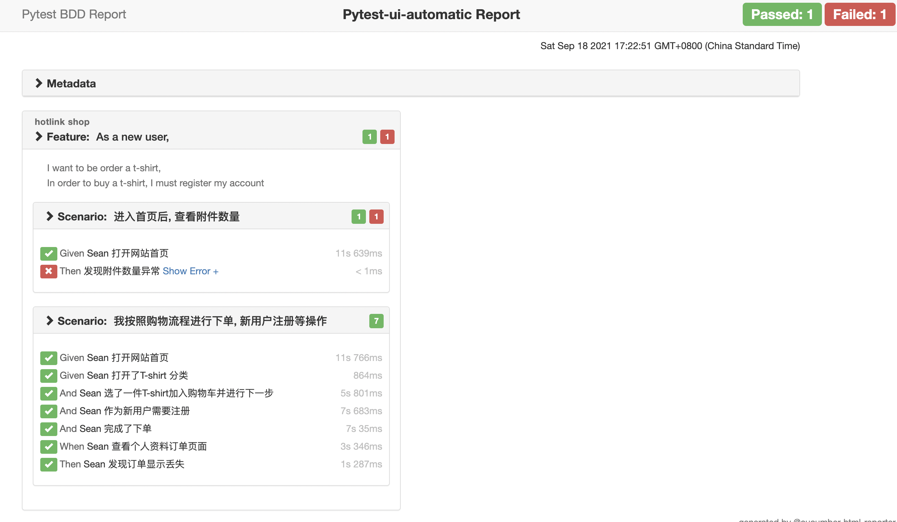
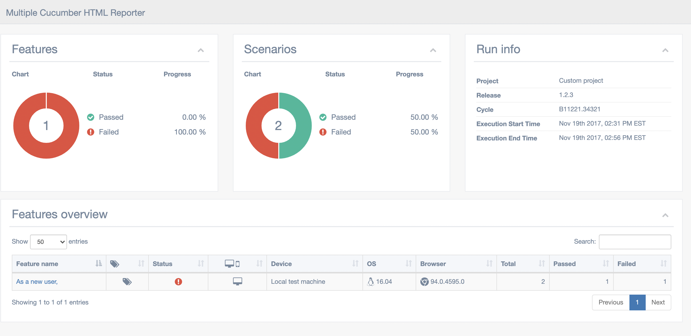

# pytest-ui-automatic
[Playwright Python](https://github.com/Microsoft/playwright-python) tool practice
pytest pytest-bdd screen-play page-object allure cucumber-report

## How to run
1. Run tests `execute_tests.sh`

## Notes:
Pretty interesting and fast-growing tool for test automation. It can have some troubles with the first setup 
(especially with Docker), but generally this tool faster than Selenium and have pretty nice facade methods out of the box.

It's hard to say if I can recommend this tool to young Python AQA engineers because Selenium is a standard 
and supports by W3C. But if you have a small project, then it can be a wise choice to use Playwright.

## Docker
Execute tests - `docker-compose run tests`

Rebuild container - `docker-compose build --no-cache setup`

## Cucumber Html Report

npm i cucumber-html-reporter
node generate-html-report.js

npm install multiple-cucumber-html-reporter 
node generate-multiple-cucumber-html-report.js 

## Pytest BDD

pytest-bdd generate features/shop/shop_order_t_shirt.feature > step_definition/shop/test_shop.py

Test code generation helpers
For newcomers it's sometimes hard to write all needed test code without being frustrated. To simplify their life, simple code generator was implemented. It allows to create fully functional but of course empty tests and step definitions for given a feature file. It's done as a separate console script provided by pytest-bdd package:

pytest-bdd generate <feature file name> .. <feature file nameN>
It will print the generated code to the standard output so you can easily redirect it to the file:

pytest-bdd generate features/some.feature > tests/functional/test_some.py
Advanced code generation
For more experienced users, there's smart code generation/suggestion feature. It will only generate the test code which is not yet there, checking existing tests and step definitions the same way it's done during the test execution. The code suggestion tool is called via passing additional pytest arguments:

pytest --generate-missing --feature features tests/functional